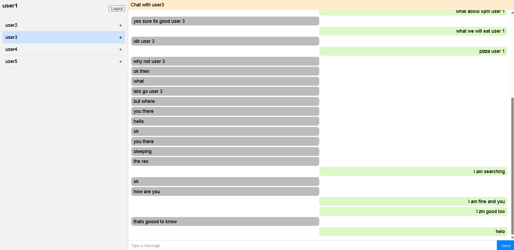

# Chaap

## FastAPI Realtime Chat App

A simple WhatsApp-like chat application built with FastAPI, WebSockets, JWT authentication, and a lightweight HTML + JavaScript frontend.

Users can register, log in, view a list of all users, and send or receive real-time messages that are stored in a database.
The UI provides a clean interface with a user list on the left and a chat panel on the right.

### Features

🔐 JWT-based authentication (login and token validation)

💬 Real-time messaging using WebSockets

🗄️ Persistent chat history stored in a relational database via SQLAlchemy

👥 User list sidebar to choose chat partners

🕓 Automatic delivery of undelivered messages when a user reconnects

🌐 Simple front-end (pure HTML, CSS, and vanilla JS — no frameworks)

👋 Create User & Logout flow supported

### Setup
1. Clone the repo
git clone https://github.com/solankiRahulFr/chaap.git
cd chaap

2. Create a virtual environment
python -m venv .venv
source .venv/bin/activate

3. Install dependencies
pip install -r backend/requirements.txt

4. Run the FastAPI server
cd backend
fastapi dev main.py

By default, the server runs on http://127.0.0.1:8000

### Frontend

The simple UI is served by FastAPI itself.
You can access it by visiting:

👉 http://127.0.0.1:8000/

**Features of the UI:**

Displays all users on the left panel.

Select a user to open the chat.

Loads message history automatically.

Disables the input field until a user is selected.

Sends and receives real-time messages via WebSocket.

### API Overview
Endpoint	Method	Description
/register	POST	Create a new user
/login	POST	Authenticate and receive JWT token
/users	GET	Fetch all users (requires JWT)
/messages/{user_id}	GET	Fetch chat history between users
/ws?token=<JWT>	WS	WebSocket endpoint for real-time messages

### Database Models
User
Field	Type
id	Integer (Primary Key)
username	String
password_hash	String
Message
Field	Type
id	Integer (Primary Key)
sender_id	ForeignKey(User.id)
recipient_id	ForeignKey(User.id)
content	String
created_at	DateTime
delivered	Boolean

### Authentication

On login, a JWT token is returned.

The frontend stores it in sessionStorage.

All API and WebSocket calls require this token in headers or as a query parameter.

### UI Preview

